# part7

## 事前準備

### Builders IDの発行

[Amazon CodeCatalyst](https://codecatalyst.aws/explore)のホームページからSign upをクリックします。

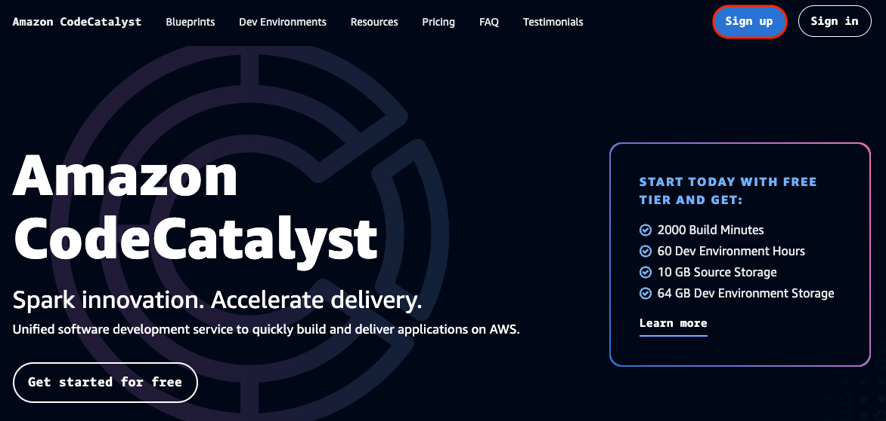

メールアドレスを入力して次へをクリックします。

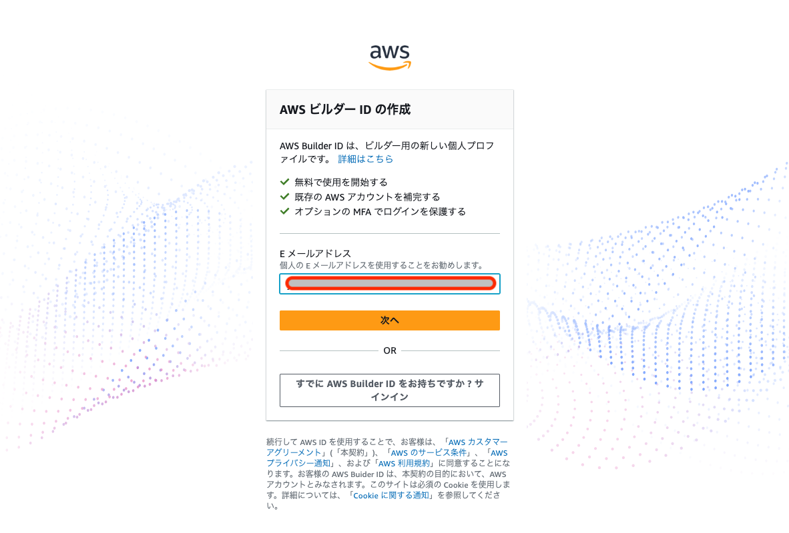

パスワードを入力して次へをクリックします。


コード入力画面に切り替わりましたら、最初に入力したメールアドレス宛に届いているメールの内容を元にコードを入力します。
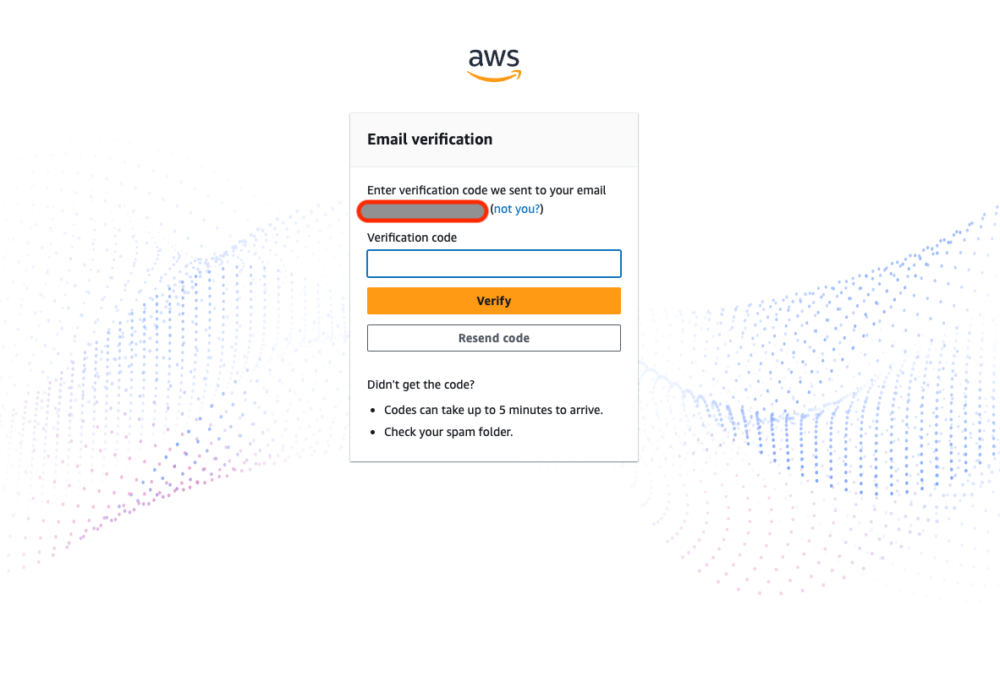

※以下のような内容でメールが届いています。
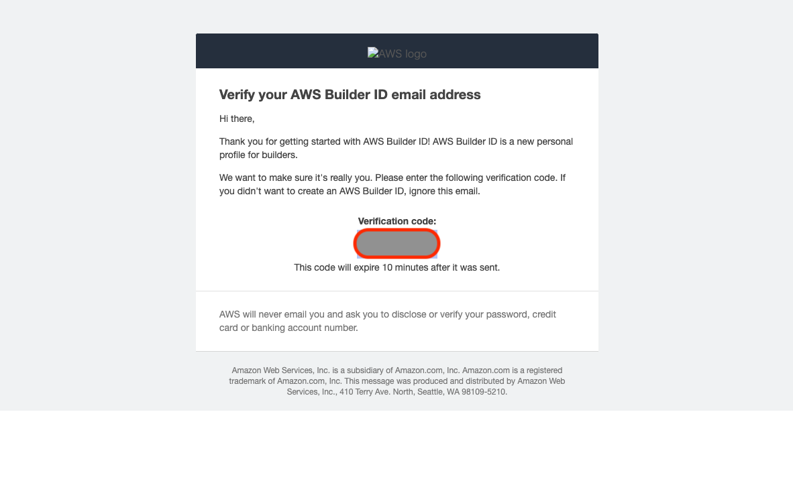

コードを入力して`Verify`をクリックします。
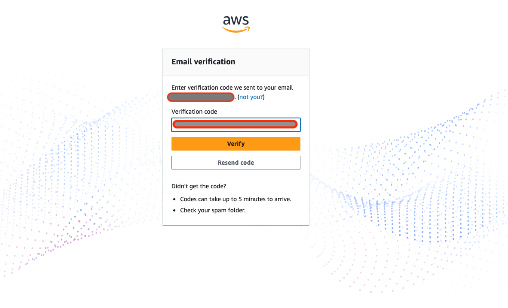

最後にパスワードを入力してAWS ビルダーIDを発行します。
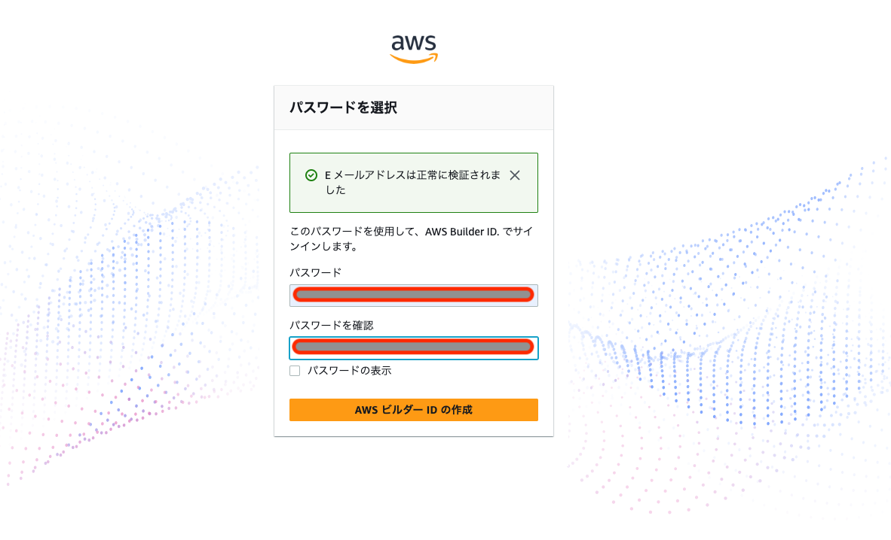

## メンション名を決める

次にCodeCatalystの設定画面に移動します。※画面が遷移します。

Amazon CodeCatalystはプルリクエストベースのレビューが実行できるため、メンションという機能が備わっています。
GitHubでソースコードのレビューをしたことがある人であれば、なんとなく想像がつくでしょう。

このメンション名というのはレビューなどの時に利用するCodeCatalyst上の名前です。わかりやすい名前で設定しておきましょう。
※執筆時点では後で変更することができない項目となっています。慎重に設定しましょう。
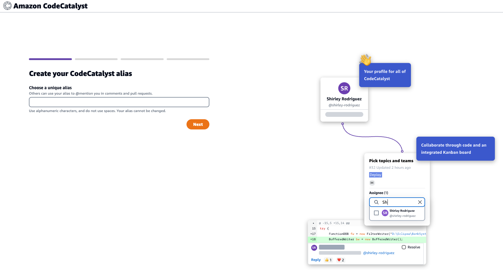

## スペース名を決める

CodeCatalystの設定場所となるSpaceを設定しましょう。このSpaceは複数のプロジェクトを内包します。


## AWSアカウントとリンクする

AWSのアカウントIDとAWS ビルダーIDをリンクします。
12桁のAWSアカウントIDを入力します。

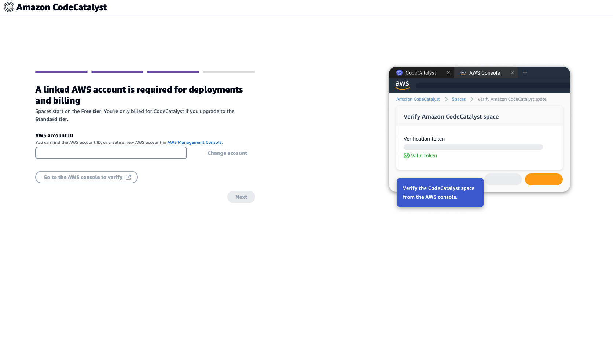

`Go to the AWS console verify`をクリックします。

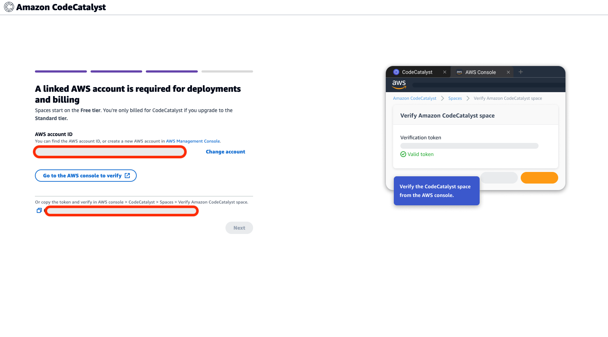

`Verify space`をクリックします。

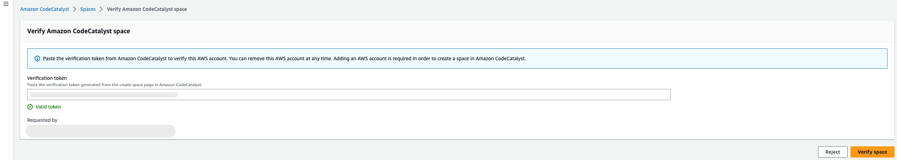

`Account verited, you can return to Amazon CodeCatalyst`と表示されましたら前の画面に戻ります。
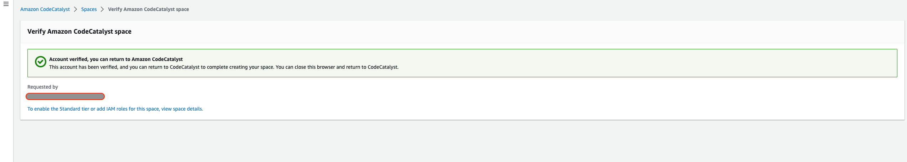

`Next`をクリックします。
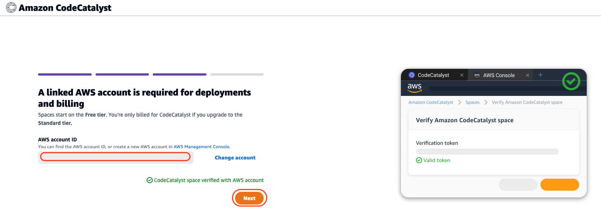

## プロジェクトを作成する

Spaceを作成しましたので次に実際にアプリケーションを置くプロジェクトを作成しましょう。
`Create your first project`をクリックします。


プロジェクト名を`handson`として`Create project`をクリックします。
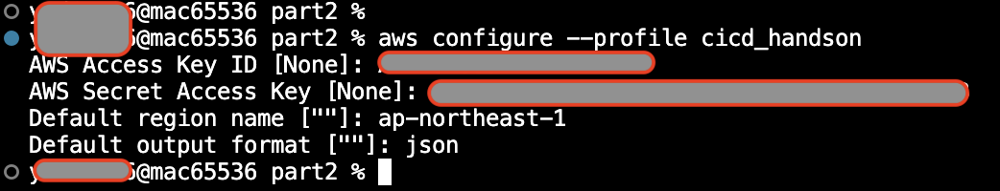

まだこの段階ではプロジェクトは作成できていません。プロジェクトを作成する場合はプロジェクトの種類を選択する必要があります。
ハンズオンでは`Start from scratch`を選択します。
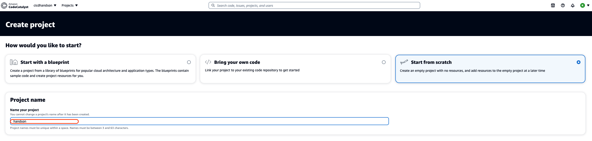

`Create project`をクリックしてプロジェクトを作成します。

## リポジトリを作成する

ソースリポジトリを作成するために右側にサイドメニューから`Source repositories`をクリックします。
画面中心にある`Add repository`の下三角マークをクリックします。


`Create repository`をクリックします。


`Repository name`、`description`を入力します。
`.gitignore`は`None`のままで問題ありません。
`Create`をクリックします。

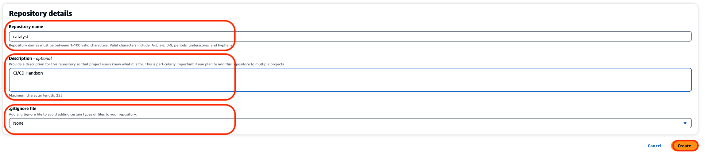

## リポジトリをクローンする

catalystリポジトリをDesktopにクローンします。
`Clone Repository`をクリックします。

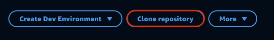

CodeCatalyst の画面からクローン用のURLとパスワードをコピーします。

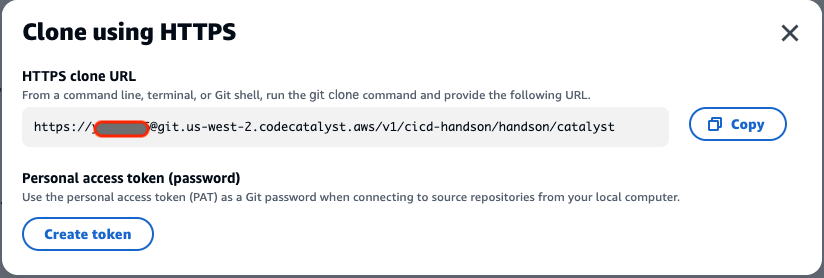

URLをコピーすると`Clone Cpied URL`と表示されます。
他のテキストエディタを開いてURLを保存しておきます。
次に`Create token`をクリックします。

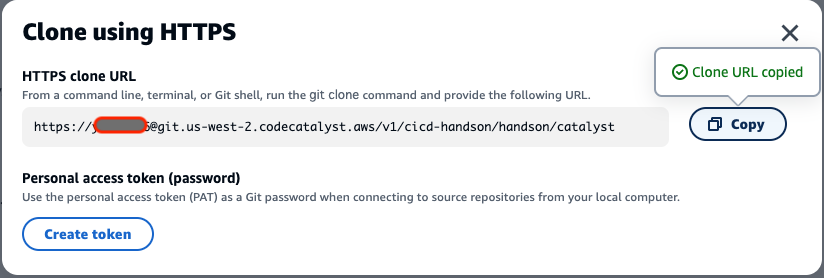

クリックすると`Personal Access token`が表示されますので右側にある`Copy`ボタンでコピーします。


Clone 用のURLと`Personal Access Token`を使ってリポジトリをCloneします。

以下のコマンドでリポジトリをクローンできます。初回クローン時にはパスワード(Personal Access Token)を聞かれます。

```sh
git clone {コピーしたクローンのURL} ~/Desktop/catalyst
```

実行例

```sh
Desktop $ git clone https://{user_name}@git.us-west-2.codecatalyst.aws/v1/cicd-handson/handson/catalyst
Cloning into 'catalyst'...
Password for 'https://{user_name}@git.us-west-2.codecatalyst.aws/v1/cicd-handson/handson/catalyst':{ここにパスワードを貼り付け}
remote: Counting objects: 3, done.
Unpacking objects: 100% (3/3), 648 bytes | 129.00 KiB/s, done.
Desktop $
```

## ブランチを作成

ディレクトリを変更します。

```sh
cd ~/Desktop/catalyst
```

テストブランチを作成します。

```sh
git checkout -b test
```

ブランチの一覧を確認します。

```sh
git branch
```

実行結果

```text
catalyst $ git branch
  main
* test
catalyst $
```

### READM.mdを変更してリモートリポジトリにプッシュする

以下のコマンドを実行してREADMEを書き換えます。

```sh
echo "# Amazon CodeCatalyst Handson" > README.md
```

変更を反映してリポジトリにプッシュします。

```sh
git add .
git commit -am "Amazon CodeCatalyst Handson"
git push --set-upstream origin test
```

### プルリクエストを作成する

リポジトリのREADME.mdが表示されている画面右上にあるMoreをクリックして`Create pull request`をクリックします。

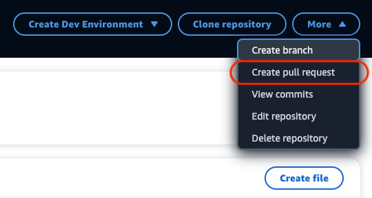

`source branch`、`pull request title`、`pull request description`を入力します。

|項目|値|
|:---|:---|
|source branch|test|
|pull request title|test pull request|
|pull request description|test pull request|

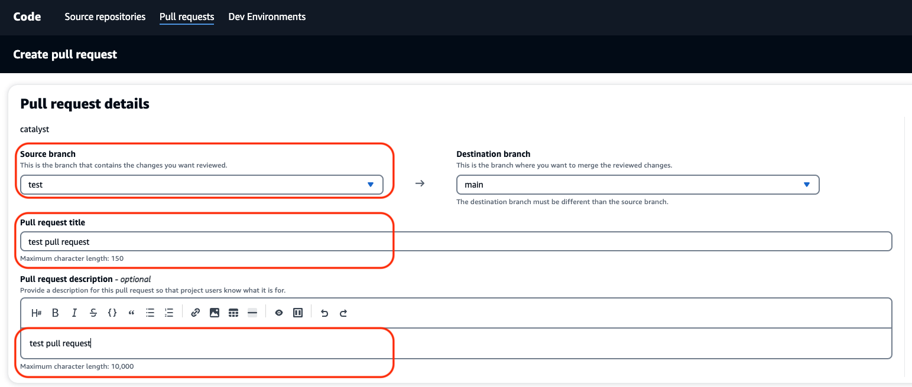

最後に右下の`Create`をクリックします。

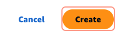

以下のように緑の背景と共に`You've created pull request`と表示されたら問題なくプルリクエストが作成できています。

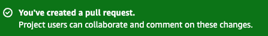

### プルリクエストをマージする

リポジトリのREADME.mdの内容が表示されている画面の右上で`Merge`を実行します。
`Merge`をクリックします。

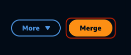

`Fast forward merge`を選択して`Merge`をクリックします。

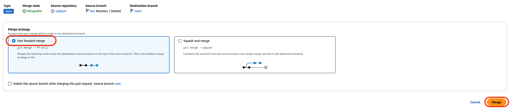

以下のように緑の背景と共に`The pull request has been merged`と表示されたら問題なくブランチがマージできています。
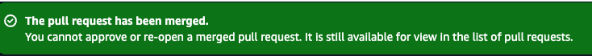

※PR1の右側でも確認できます。
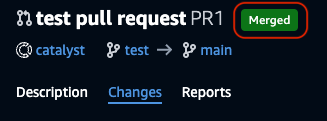

### マージされた結果を見る

ソースリポジトリを開くために右側にサイドメニューから`Source repositories`をクリックします。

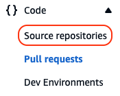

catalystリポジトリをクリックします。
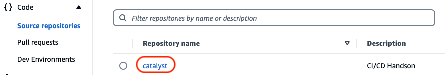

README.mdが`Amazon Codecatalyst Handson`となっていれば、マージした内容が反映されています。

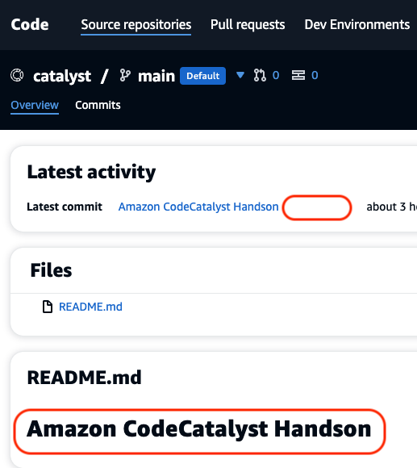

## まとめ
