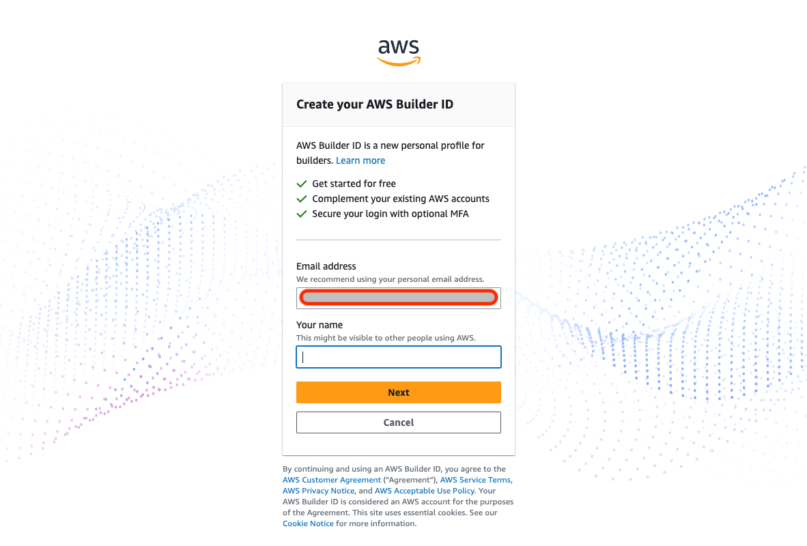
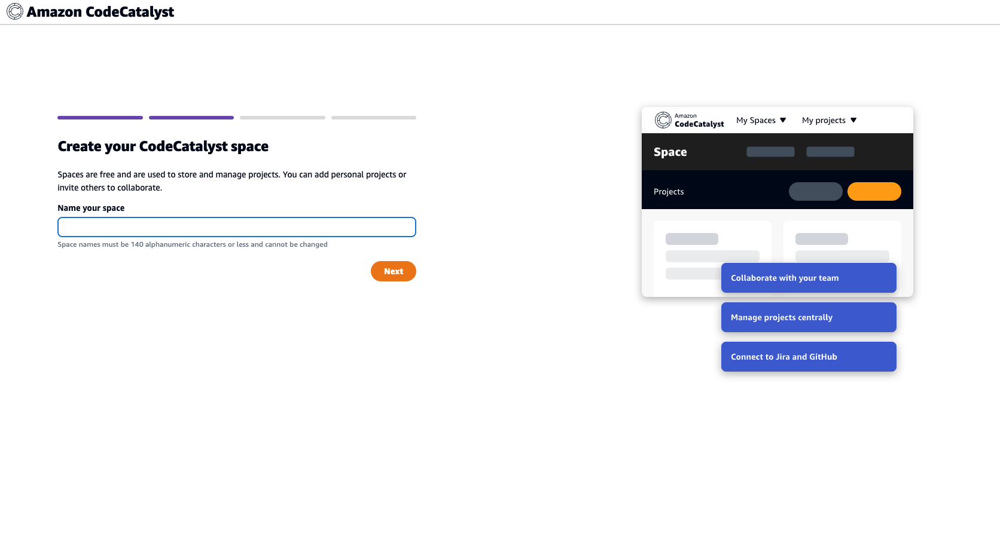

# part7

## 事前準備

### Builders IDの発行

[Amazon CodeCatalyst](https://codecatalyst.aws/explore)のホームページからSign upをクリックします。

メールアドレスを入力します。





## メンション名を決める


## スペース名を決める




## AWSアカウントとリンクする


## プロジェクトを作成する


## リポジトリを作成する


## リポジトリをクローンする

catalystリポジトリをDesktopにクローンします。
CodeCatalyst の画面からクローン用のURLとパスワードをコピーします。

以下のコマンドでリポジトリをクローンできます。初回クローン時にはパスワード(Personal Access Token)を聞かれます。

```sh
git clone {コピーしたクローンのURL} ~/Desktop/catalyst
```

実行例

```sh
Desktop $ git clone https://{user_name}@git.us-west-2.codecatalyst.aws/v1/cicd-handson/handson/catalyst
Cloning into 'catalyst'...
Password for 'https://{user_name}@git.us-west-2.codecatalyst.aws/v1/cicd-handson/handson/catalyst':{ここにパスワードを貼り付け}
remote: Counting objects: 3, done.
Unpacking objects: 100% (3/3), 648 bytes | 129.00 KiB/s, done.
Desktop $
```

## ブランチを作成

ディレクトリを変更します。

```sh
cd ~/Desktop/catalyst
```

テストブランチを作成します。

```sh
git checkout -b test
```

ブランチの一覧を確認します。

```sh
git branch
```

実行結果

```text
catalyst $ git branch
  main
* test
catalyst $
```

### READM.mdを変更してリモートリポジトリにプッシュする

以下のコマンドを実行してREADMEを書き換えます。

```sh
echo "# Amazon CodeCatalyst Handson" > README.md
```

変更を反映してリポジトリにプッシュします。

```sh
git add .
git commit -am "Amazon CodeCatalyst Handson"
git push --set-upstream origin test
```

### プルリクエストを作成する
