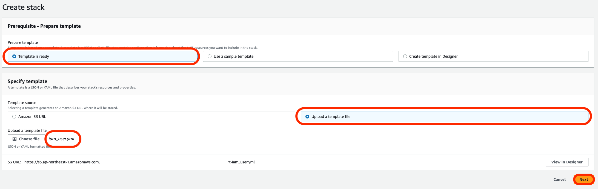

# part7

## Builders IDの発行

[Amazon CodeCatalyst](https://codecatalyst.aws/explore)のホームページからSign upをクリックします。

メールアドレスを入力します。

## 事前準備

[aws_happy_code - GitHub](https://github.com/ymd65536/aws_happy_code.git)をgitコマンドでDesktop上にcloneします。

## IAMユーザーを作成する

part5ディレクトリにある`iam_user.yml`を使ってハンズオンで利用するIAMユーザーを作成します。
※すでにAdministratorAccessで権限を作成されている場合はこの動作は不要です。

AWSマネジメントコンソールを開き、CloudFormationを検索します。


`create stack`をクリックします。


画面の内容に沿って`iam_user.yml`を指定します。`Next`をクリックします。


`cicdhandson-user`と入力して`Next`をクリックします。


`I acknowledge that AWS CloudFormation might create IAM resources with custom names.`にチェックを入れて`Submmit`をクリックします。


`CREATE_COMPLETE`と表示されましたら問題なくIAMユーザーが作成できています。


問題なくスタックが作成できましたら`Outputs`からアクセスキーとシークレットアクセスきーをコピーします。


## IAM Identity Centerを利用している場合

IAMユーザーを利用しておらず、既にIAM Identity Centerを設定している場合は以下のコマンドを実行することで次の手順に進めます。
`{Profile名}`にはご自分で作成したプロファイル名を指定します。

```sh
aws sso login --profile {Profile名}
```

プロファイル名は`credentials`を調べることでチェックできます。

```sh
cat ~/.aws/credentials 
```

### AWS　CLIをにIAMユーザーを記録する

AWS CLIを設定する為に以下のコマンドを実行します。

```sh
aws configure --profile cicd_handson
```

いくつか質問がなされるので順番に回答します。ここで先ほどのアクセスキーとシークレットアクセスキーを利用します。
`AWS Access Key Id`にアクセスキー、`AWS Secret Access Key`にシークレットアクセスキーを入力します。
リージョンはap-northeast-1、出力形式はjsonで問題ありません。


最後に設定されているかどうかを確認する為、`credentials`をチェックします。`[cicd_handson]`という項目が追加されていれば問題ありません。

```sh
cat ~/.aws/credentials 
```

### リポジトリを作成する

`aws_happy_code`リポジトリでターミナルを開き、part5にディレクトリを変更します。

```sh
cd ~/Desktop/aws_happy_code/part5
```

```sh
aws cloudformation deploy --stack-name codecommit --template-file ./codecommit.yml --tags Name=cicdhandson --profile cicd_handson
```

### CodeCommitのリポジトリをクローンする

Desktop上にCodeCommitのリポジトリをcloneします。

```sh
git clone codecommit::ap-northeast-1://cicd_handson@cicdhandson ~/Desktop/cicdhandson
```

ディレクトリを移動します。

```sh
cd ~/Desktop/cicdhandson
```

### mainブランチを作成

```sh
git checkout -b main
```

```sh
echo "Hello App Runner" > README.md
```

```sh
git add .
git commit -m "App Runner"
git push -u 
```

### app_runner ブランチを切る

新しいブランチでビルドを実行する為にCodeBuild用に新しくブランチを切ります。

```sh
git checkout -b app_runner
```

### buildspec.yamlを作成する

CodeBuildで利用する設定ファイル(buildspec.yml)を作成します。
aws_happy_codeリポジトリにある`buildspec.yml`を`cicdhandson`リポジトリにコピーします。

```sh
cp ~/Desktop/aws_happy_code/buildspec.yml ~/Desktop/cicdhandson/
```

### dockerfileを作成する

dockerfileを`cicdhandson`リポジトリにコピーします。

```sh
cp ~/Desktop/aws_happy_code/dockerfile ~/Desktop/cicdhandson/
```

### リモートリポジトリを更新する

CodeCommitのリモートリポジトリにdockerfileをpushします。
リモートリポジトリにブランチを追加します。

```sh
git add .
git commit -m "add files"
git push --set-upstream origin app_runner
```

### CodeBuild用 S3バケットの作成

cicdhandsonリポジトリに移動します。

```sh
cd ~/Desktop/cicdhandson
```

以下のコマンドで`s3.yml`をCloudFormationで実行します。

```sh
aws cloudformation deploy --stack-name s3 --template-file ./s3.yml --tags Name=cicdhandson --profile cicd_handson
```

### ECRリポジトリの作成

以下のコマンドで`ecr.yml`をCloudFormationで実行します。

```sh
aws cloudformation deploy --stack-name ecr --template-file ./ecr.yml --tags Name=cicdhandson --profile cicd_handson
```

### ハンズオンで利用するIAM Roleを作成する

以下のコマンドを実行してIAMロールを作成します。

```sh
aws cloudformation deploy --stack-name codebuild-iam-role --template-file ./codebuild-role.yml --tags Name=cicdhandson --capabilities CAPABILITY_NAMED_IAM --profile cicd_handson && aws cloudformation deploy --stack-name event-bridge-iam-role --template-file ./event-bridge-iam-role.yml --tags Name=cicdhandson --capabilities CAPABILITY_NAMED_IAM --profile cicd_handson && aws cloudformation deploy --stack-name pipeline-iam-role --template-file ./pipeline-iam-role.yml --tags Name=cicdhandson --capabilities CAPABILITY_NAMED_IAM --profile cicd_handson

```

### CodePipeline を構築

以下のコマンドを実行してCodePipelineのを構築します。

```sh
aws cloudformation deploy --stack-name code-build --template-file ./code-build.yml --tags Name=cicdhandson --profile cicd_handson && aws cloudformation deploy --stack-name pipeline --template-file ./pipeline.yml --tags Name=cicdhandson --profile cicd_handson
```

### プルリクエストを作成する

環境構築は以上となります。CodeCommitでプルリクエストを作成する為に以下のコマンドを実行します。

```sh
aws codecommit create-pull-request --title "new pull request" --description "App Runner ci/cd" --targets repositoryName=cicdhandson,sourceReference=app_runner --profile cicd_handson && PULL_REQUEST_ID=`aws codecommit list-pull-requests --profile cicd_handson --pull-request-status OPEN --repository-name cicdhandson --query 'pullRequestIds' --output text` && echo $PULL_REQUEST_ID && COMMITID=`aws codecommit get-branch --repository-name cicdhandson --branch-name app_runner --profile cicd_handson --query 'branch.commitId' --output text` && echo $COMMITID
```

### ブランチをマージする

プルリクエストをマージします。

```sh
aws codecommit merge-pull-request-by-fast-forward --pull-request-id $PULL_REQUEST_ID --source-commit-id $COMMITID --repository-name cicdhandson --profile cicd_handson
```

結果

```json
{
    "pullRequest": {
        "pullRequestId": "11",
        "title": "new pull request",
        "description": "App Runner ci/cd",
        "lastActivityDate": "2023-06-15T20:25:04.181000+09:00",
        "creationDate": "2023-06-15T20:23:08.812000+09:00",
        "pullRequestStatus": "CLOSED",
        "authorArn": "arn",
        "pullRequestTargets": [
            {
                "repositoryName": "cicdhandson",
                "sourceReference": "refs/heads/app_runner",
                "destinationReference": "refs/heads/main",
                "destinationCommit": "",
                "sourceCommit": "",
                "mergeBase": "",
                "mergeMetadata": {
                    "isMerged": true,
                    "mergedBy": "arn",
                    "mergeCommitId": "",
                    "mergeOption": "FAST_FORWARD_MERGE"
                }
            }
        ],
        "clientRequestToken": "",
        "revisionId": "",
        "approvalRules": []
    }
}
```

### ビルドされたイメージを確認する

CodeBuildでイメージがビルドされているかを確認します。

```sh
aws ecr list-images --profile cicd_handson --repository-name cicdhandson --query "imageIds[*].imageDigest" --output table
```

結果

```text
-----------------------------------------------------------------------------
|                                ListImages                                 |
+---------------------------------------------------------------------------+
|  sha256:70f9eda4317cdce66c06fe1a699cae9bb1627cac91e1c9c6a09f6b3572fd56b4  |
+---------------------------------------------------------------------------+
```

### App Runnerにコンテナをデプロイする

```sh
aws cloudformation deploy --stack-name apprunner --template-file ./app_runner.yml --tags Name=cicdhandson --capabilities CAPABILITY_NAMED_IAM --profile cicd_handson
```

実行結果

